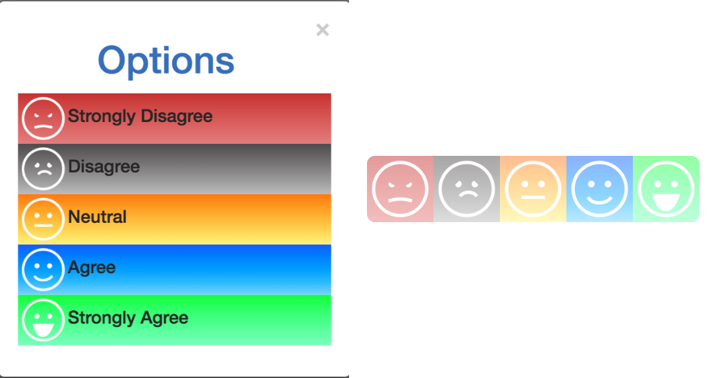
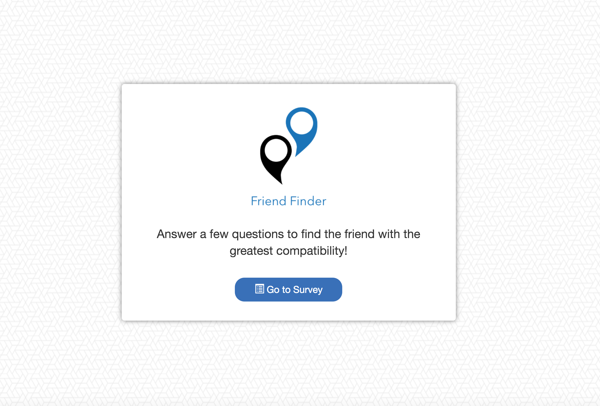
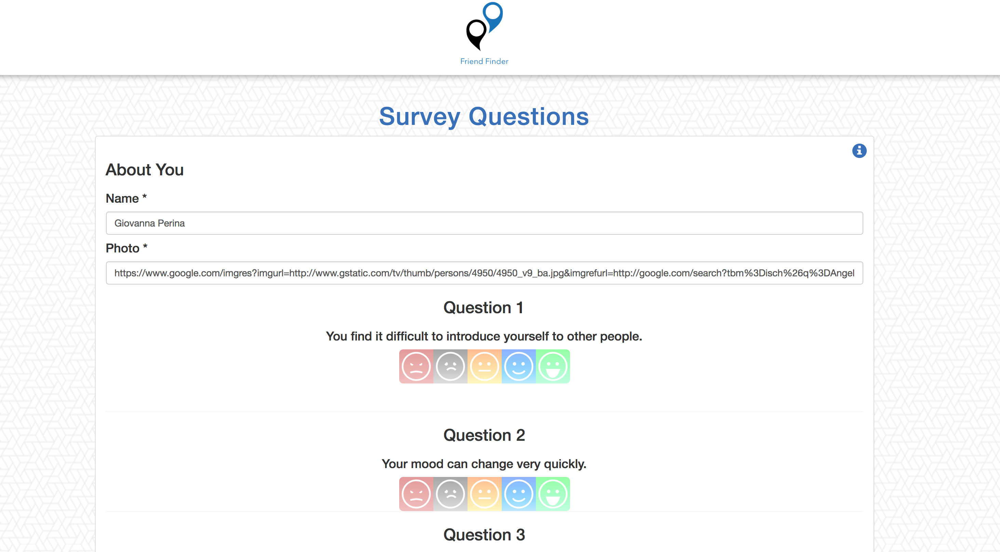
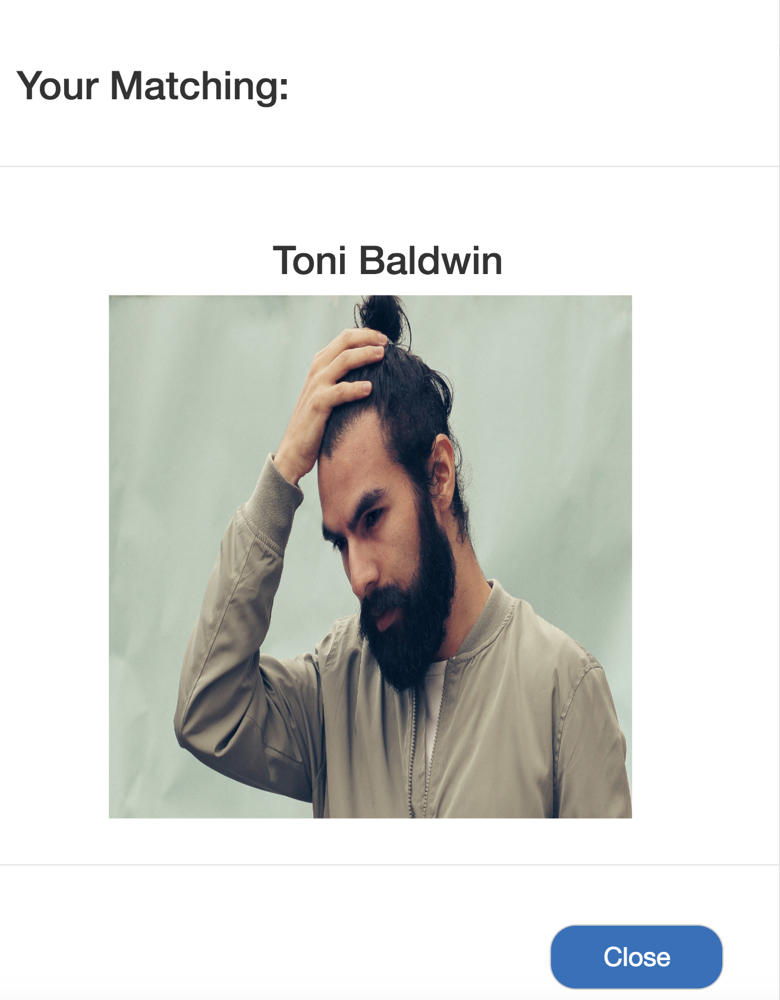

# FriendFinder 

Friend Finder is a compatibility-based application. This full-stack site will take in results from the users' surveys, then compare their answers with those from other users. The app will then display the name and picture of the user with the best overall match.

Please check out the launched app on Heroku [Here!](https://ancient-savannah-73863.herokuapp.com/)

## Instructions 

* The survey has a total of 10 questions.The answers to the survey questions are on a scale of 1-5 based on how much the user agrees or disagrees.

## Layout 

### Main Page 

### Survey Page 

### Matching

## Technical Details 

* The application use Express to handle routing. 

* NPM Packages: [Express](https://www.npmjs.com/package/express), [Path](https://www.npmjs.com/package/path), and [Body-Parser](https://www.npmjs.com/package/body-parser). 

## Built With 
* Visual Studio Code
* Bootstrap 3.3.7
* Font Awesome